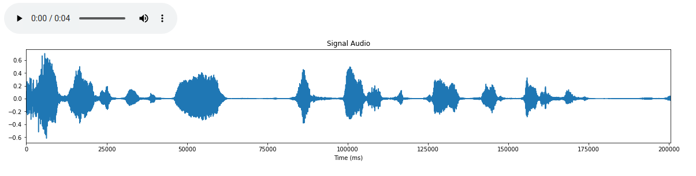

[](https://github.com/AlfaBD/ibpl-alfa-bd-2021/projects/16)
[](https://github.com/AlfaBD/ibpl-alfa-bd-2021/projects/16)
[](https://docs.python.org/3/)
[](https://github.com/timsainb/noisereduce)


# ALFA - BD
## Análise de Fluência na Alfabetização em Big Data

# Documentação do Script de Tratamento de áudio US117 - v1.0

Este repositório tem por objetivo orientar a utilização do script desenvolvido para atuação na **US117: "COMO Investidor
DESEJO QUE seja criado uma interface de Dashboard Alunos
PARA exibir o seu histórico"**.

**Reference**: Tim Sainburg. **Software to Noise Reduction - noisereduce: v1.0**. Zenodo: 2019. Disponível em: https://github.com/timsainb/noisereduce

### Conteúdo:
---
* Instalações
* Funções básicas
* Como aplicar
---

### Instalação
---

#### Instalação das bibliotecas necessárias

É necessário uma conta Gmail para utilização do Google Colab deste [código](https://github.com/AlfaBD/ibpl-alfa-bd-2021/blob/homologacao/audiotreatment/ALFA_BD_Audio_Treatment.ipynb), se preferir pode instalar as seguintes bibliotecas

```python
pip install librosa
pip install noisereduce
pip install soundfile
pip install pydu
```

### Funções básicas
---
São três funções básicas desenvolvidas no script:
1. Conversão da extensão do áudio: convert_wav();
2. Leitura e reprodução do áudio: plot_audio_data();
3. Aplicação do tratamento: alfa_bd_AT().
---
**1. Conversão da extensão do áudio: convert_wav()**

Utiliza como entrada o arquivo de áudio nos formatos mp3 ou ogg, transformando-os na extensão wav.
```python
def convert_wav(src):
  ext = src[src.index('.'):]
  name =  src[src.index('/') + 1:src.index('.')]
  dst = "converted/"
  if ext == ".wav":
    original = src
    dst = dst + name + ext
    shutil.copyfile(original, target)
  else:
    if ext == ".ogg":
      sound = AudioSegment.from_ogg(src)
    elif ext == ".mp3":
      sound = AudioSegment.from_mp3(src)
    dst = dst + name + "_" + ext[1:] +".wav"
    sound.export(dst, format="wav")

  src = dst
  return src
```
2. Leitura e reprodução do áudio: plot_audio_data();

Após converter o áudio para o formato wav, é realizado uma transformação do arquivo para um vetor utilizando a biblioteca soundfile. A função criada tem como entrada as saídas apresentadas abaixo e como saída da mesma obtêm-se uma imagem das ondas sonoras do áudio e um player para que possa ser ouvido.
```Python
data, rate = sf.read(src)
def plot_audio_data(data,rate):
  fig, ax = plt.subplots(figsize=(20,3))
  ax.plot(data)
  plt.title("Signal Audio")
  plt.xlabel("Time (ms)")
  plt.xlim([0, len(data)])
  plt.ylabel("")
  return IPython.display.Audio(data=data, rate=rate)
  ```
  

**3. Aplicação do tratamento: alfa_bd_AT()**

Esta função é a função principal que utiliza ambas anteriores para tratamento completo de áudio. Tem como entradas o arquivo de áudio a ser tradado no formato string e o nome/ formato do arquivo de saída.
```Python
def alfa_bd_AT(src,dst):
  src = convert_wav(src)
  data, rate = sf.read(src)
  noise_clip = data/1.15
  noise_reduced = nr.reduce_noise(audio_clip=data, noise_clip=noise_clip,prop_decrease=1.0,  verbose=True)
  plt.figure(figsize=(20,9))
  plt.subplot(2,1,1)
  plt.plot(data)
  plt.title("Signal Audio - Com ruido")
  plt.xlim([0, len(data)])
  plt.subplot(2,1,2)
  plt.plot(noise_reduced)
  plt.title("Signal Audio - Sem ruido")
  plt.xlim([0, len(noise_reduced)])
  plt.xlabel("Time (ms)")
  wavfile.write(dst,rate,noise_reduced)
  raw = IPython.display.Audio(data=data, rate=rate)
  fix = IPython.display.Audio(data=noise_reduced, rate=rate)
  return raw, fix
```
### Como aplicar
---
Estando no mesmo diretório contendo os arquivos/ ou escrevendo o caminho relativo do arquivo de entrada, utilizar o exemplo de áudio abaixo.

[Áudio ruim](/exemplo_audio_ruim.wav)

Então, dentro do script, utilizar a função abaixo:

```python
raw, fix = alfa_bd_AT("exemplo_audio_ruim.wav","exemplo_audio_recuperado.mp3")
```
Será então criado um arquivo exemplo_audio_recuperado.wav no mesmo diretório, mostrado abaixo.

[Áudio recuperado](/exemplo_audio_recuperado.wav)
